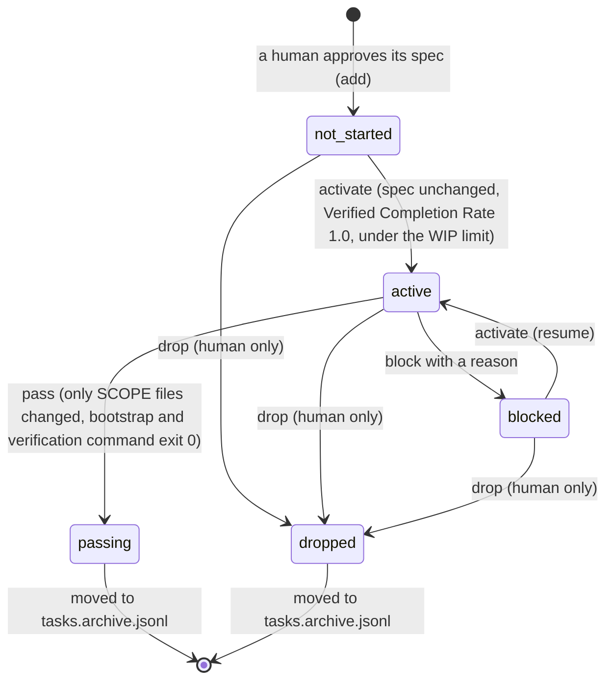
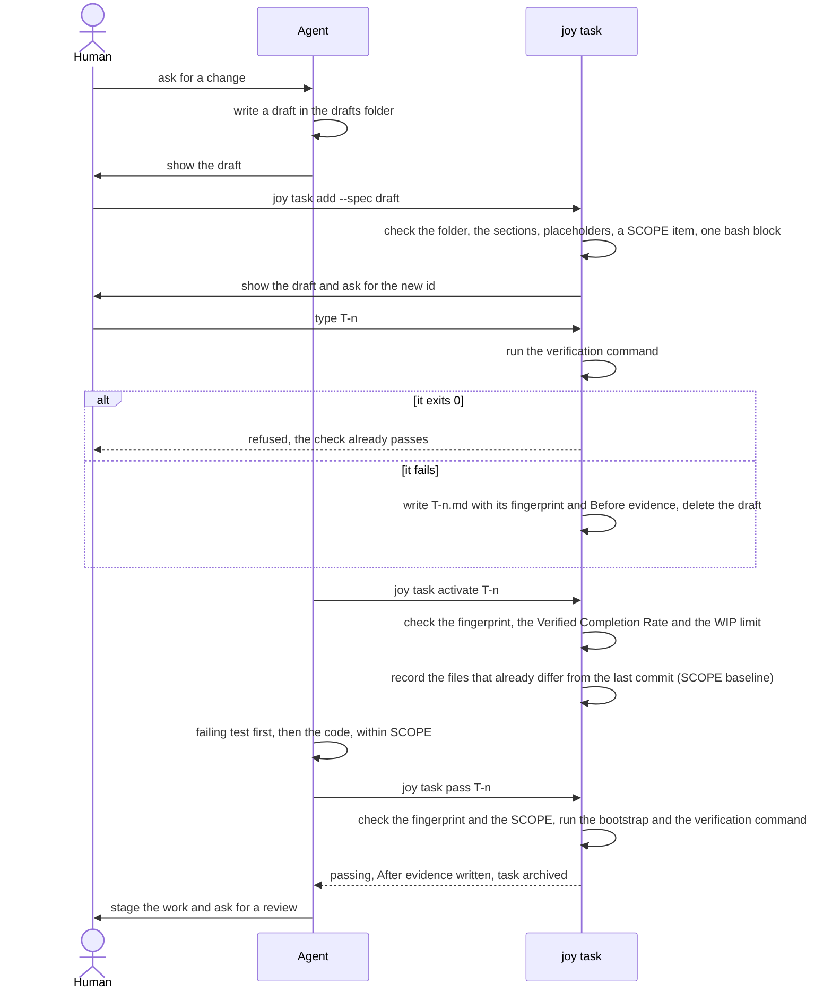
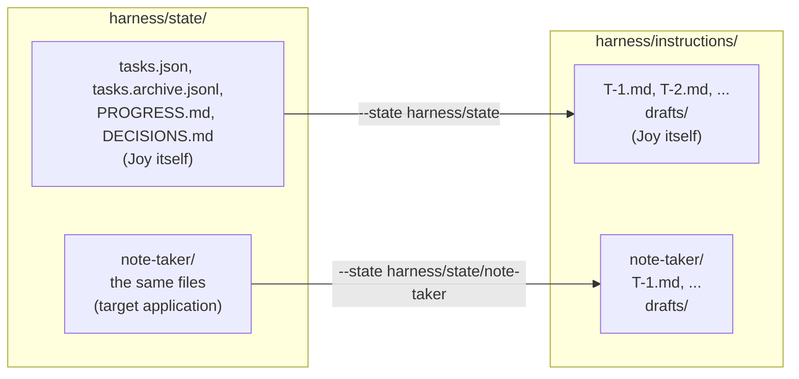

# Joy Code

Joy Code is a wannabee clone of [Claude Code](https://claude.com/claude-code), built using the contents of [Hands-On Harness Engineering](https://hands-on-harness-engineering.com/) as a starter, but in Python instead of Node.

## Bootstrap

On a fresh clone, and at the start of every coding-agent session, run:

```bash
./init.sh
```

It installs the locked dependencies and checks that Joy can start and be tested. See [`BOOTSTRAP.md`](BOOTSTRAP.md) for its contract and exit codes.

## Running the CLI

The CLI lives in the `cli` folder and is managed with [uv](https://docs.astral.sh/uv/).

### Dev mode

Run the CLI from source:

```bash
cd cli && uv run joy --help
```

### Prod mode

Build a standalone executable with [PyInstaller](https://pyinstaller.org/) into the root `bin` folder (intermediate build files go in `cli/build`):

```bash
cd cli && uv run pyinstaller --onefile --copy-metadata joy --name joy --distpath ../bin --workpath build --specpath build joy.py
```

Then run the executable (no Python or uv needed):

```bash
./bin/joy --help
```

The executable only runs on the OS and CPU architecture it was built on.

## Testing

Tests use [pytest](https://docs.pytest.org/), a uv dev dependency. Run the suite from the `cli` folder:

```bash
cd cli && uv run pytest
```

This is Joy's verification check. For now `cli/test_suite.py` only proves the suite runs.

## Harness

The `harness` folder holds the harness we use to develop the coding agent.

[`AGENTS.md`](AGENTS.md) holds the rules coding agents follow in this repository: the startup workflow, the working rules, the progress files, the definition of done and the end-of-session steps.

### Task ledger

Each state folder under `harness/state/` holds a `tasks.json` ledger that enforces the WIP limit, 1 by default (see [`AGENTS.md`](AGENTS.md)). Manage it from the repository root with:

```bash
uv run --locked --project cli joy task --help
```

Only a human can add a task: `joy task add --spec <draft>` shows a spec draft and asks to type the new task id in an interactive terminal (see Tasks below). `joy task activate` refuses to start a task while the Verified Completion Rate (passing tasks / activated tasks) is below 1.0, and only `joy task pass`, which refuses work that changed files outside the task's SCOPE, runs the ledger's bootstrap script and the task's verification command and records the evidence, marks a task `passing`. Finished tasks move to `tasks.archive.jsonl`, so the ledger stays the size of the open work. Only a human can drop a task (`joy task drop` asks to type the task id in an interactive terminal) or change the WIP limit, 1 by default (`joy task wip <n>` asks to type the new limit there).

A task moves through these states, and leaves the ledger once it is finished:



### Tasks

`harness/instructions` holds the approved task specifications, one per task, named after the task ledger id (`T-1.md`, `T-2.md`, ...; `harness/instructions/<application>/` for a target application). Each starts as a draft based on [`instruction_template.md`](instruction_template.md), written in the drafts folder (`harness/instructions/drafts/`, or `harness/instructions/<application>/drafts/` for a target application), with five sections:

- **TASK**: the behavior to build, as a user or caller observes it.
- **SCOPE**: the files the task may change, one `- ` item each starting with a path in backticks (a path ending in `/` covers a whole folder). `joy task pass` refuses work that changed anything else (see SCOPE check below), so anything else becomes a new draft or a question for a human.
- **DONE WHEN**: the definition of done, including one verification command that decides pass or fail by its exit code and sets up its own data.
- **STATE**: the task's current state, written by `joy task`.
- **EVIDENCE**: the verification command's output when the spec was approved and when the task passed, written by `joy task`.

A human approves a draft with `joy task add --spec <draft>`. Joy then runs the verification command and refuses the draft if it already passes, since such a check cannot prove the work. It fingerprints TASK, SCOPE and DONE WHEN, and `joy task activate` and `joy task pass` refuse to run once they changed, so the definition of done cannot be weakened during the work.

From a request to a passing task, the agent, the human and `joy task` each do their part:



The instructions folder mirrors the state folder, so each application has its own ledger, specs and drafts:



#### Spec fingerprint

An approved spec is the task's definition of done. An agent stuck on a task could otherwise make it pass by changing that definition instead of doing the work: weakening the verification command until it exits 0, widening SCOPE to cover the files it had to touch, or rewording TASK to describe what it built. The fingerprint makes any such change visible to `joy task`, which then refuses to go on.

**What it covers.** Everything above `## STATE` in `T-n.md`: the `# T-n. title` line, TASK, SCOPE and DONE WHEN, byte for byte. Fixing a typo or changing whitespace counts as a change too. STATE and EVIDENCE are left out, because `joy task` rewrites them from the ledger on every change.

**How it is made.** When a human approves a draft, `joy task add --spec` takes the SHA-256 hash of that text and stores it in the ledger (`tasks.json`), next to the spec's path and the ledger's own copy of the verification command.

**When it is checked.** `joy task activate`, also when resuming a `blocked` task, and `joy task pass` hash the frozen part of `T-n.md` again. When the hash differs, or the file is missing, they refuse to run with:

```text
harness/instructions/T-n.md changed since it was approved (TASK, SCOPE or DONE WHEN): restore it, or ask a human to drop T-n and approve a new draft
```

`joy task pass` then runs the ledger's copy of the verification command, not the one in the file, so the command that decides `passing` is always the one the human approved.

**How to recover.** Restore the frozen part of `T-n.md` exactly as it was approved. Approved specs are not tracked by git (`harness/instructions/.gitignore`), so there is no `git checkout` to fall back on: undo the edit by hand. When the spec itself turns out to be wrong, the fix is not to edit it: a human drops the task (`joy task drop`) and approves a new draft.

**Its limits.** The fingerprint protects the definition of done, not the work: checking which files the work changed is the job of the SCOPE check below. And it is only as safe as the ledger that stores it: an edited `tasks.json` could carry a new hash, which is why [`AGENTS.md`](AGENTS.md) forbids editing harness task JSON files by any means.

#### SCOPE check

The fingerprint keeps SCOPE from changing; the SCOPE check makes the work stay inside it. Without it, an agent could "also" fix or refactor files the human never approved it to touch, and the task would still pass.

**What SCOPE allows.** When a human approves a draft, `joy task add --spec` reads one path from each `- ` item of SCOPE, the text in backticks at the start of the item, and keeps its own copy in the ledger. A path is relative to the repository root and names a file, or a folder when it ends in `/`, covering every file under it. `add` refuses a draft with an item that does not start with a path.

**The baseline.** The repository is rarely clean when a task starts: other work may be staged or waiting for a review. So the first `joy task activate` records the current commit and a SHA-256 hash of every file that already differs from it, staged, unstaged or untracked. Resuming a `blocked` task keeps that first baseline, so work done before the block still counts. Outside a git repository, `activate` refuses.

**What the work changed.** At `joy task pass`, a file counts as changed when its content differs from the baseline: a new, edited or deleted file, a change committed since activation, or a file that was already modified at activation and was edited again or restored. Changes that were already there and are left alone do not count. Neither do gitignored files, such as the ledgers, the progress files and the specs, which `joy task` and the agent write as part of the routine.

**When it is checked.** `joy task pass` runs it right after the fingerprint, before the bootstrap. When a changed file is outside SCOPE, it refuses, and the task stays `active`:

```text
refused: T-n changed files outside its SCOPE since it was activated: docs/x.md. Undo those changes, or ask a human to drop T-n and approve a draft with the right SCOPE.
```

**How to recover.** Undo the changes outside SCOPE, and write a draft for them if they are worth doing. When the task really needs them, its SCOPE is wrong: a human drops the task and approves a new draft. When a human made the change during the task, ask a human too.

**Its limits.** The check sees files, not intent: any change to a file in SCOPE passes it, which is what the verification command and the human review are for. Tasks approved or activated before the check existed have no SCOPE copy or baseline, and `pass` skips the check for them.

## Examples

The `examples` folder is meant to hold example applications built with the Joy coding agent and its harness.
