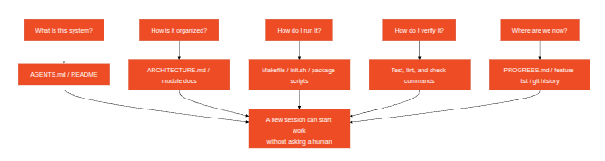
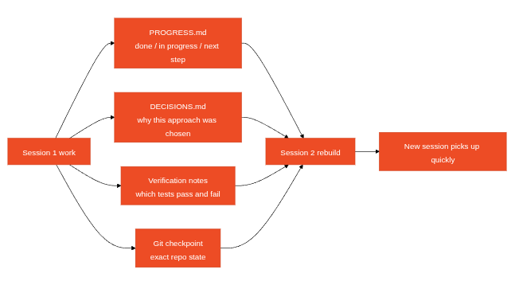
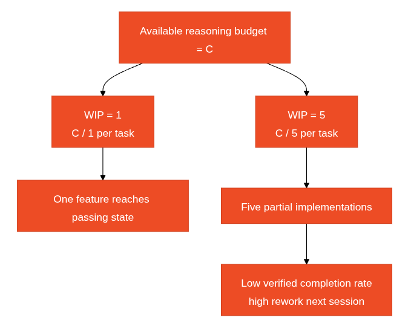

# notes from [hands on harness engineering course](https://hands-on-harness-engineering.com/)


## general principles

- A coding agent's reliability hinges on five things outside the model: 
    - a sane execution environment
    - clear instructions
    - durable state
    - the right tools
    - verification feedback
- AI coding agents are capable. The problem is making them _reliable_. 
- Anthropic found that agents confidently praise their own work, and the solution is to separate "the agent who does the work" from "the agent who checks the work."
- Common problems in harness engineering are:
    - Definition of Done: A set of machine-verifiable conditions — tests pass, lint is clean, type checks pass. Without an explicit definition of done, the agent will invent its own.
    - Verification Gap: The gap between the agent's confidence in its output and actual correctness. The agent says "I'm done" when it's not done — this is the most common failure mode.
- **Harness** definition: Everything outside the model — instructions, tools, environment, state management, verification feedback. If it's not model weights, it's harness.
- In harness engineering, a diagnostic loop consists of executing, observing, and attributing the failure to one of the 5 harness layers, to fix that layer, and to re-execute.
- In harness engineering, a system of record (SoR) is the central, authoritative data source that serves as the "single source of truth" for a project. This is absolutely mandatory for an AI coding agent: the repository at hand should be the self-contained source of information on how to build stuff. It's called the "repo as spec" principle. You should be particularly mindful of not having contradictions in this source of truth.
- one good methodology in testing harness quality is to stay "iso-model", meaning, don't swap models to get better results, improve each subsystem to the max before deciding to upgrade the model; also one good approach in improving a harness is to distinguish between:
    - "gulf of execution": agent does not know _how_ to do something
    - "gulf of verification": agent does not if what it built is _right_
- OpenAI distills the engineer's core job into three things: designing environments, expressing intent, and building feedback loops.
- The 5 defense layers in developing a good agentic application are: 
    - context provision
        - e.g. a `CLAUDE.md` at the repo root saying "use `pnpm`, not `npm`; tests live in `tests/`", so the agent doesn't have to guess
    - execution environment
        - e.g. the agent runs inside a Docker container with only the project folder mounted and no network access, so a bad `rm -rf` can't touch the host
    - state management
        - e.g. the agent keeps a `progress.md` checklist ("[x] add model, [ ] add API route") and commits after each step, so it can resume after a crash or context reset
    - task specification
        - e.g. instead of "fix the login", the task says "login with a wrong password must return HTTP 401 and show 'Invalid credentials'; don't touch the signup flow"
    - verification feedback
        - e.g. after each change the agent runs `pnpm test && pnpm lint` and reads the failures, looping until everything is green before saying it's done


## the five-subsystem harness model


In harnessing a coding agent, you'd have 5 subsystems:

- instruction
- tooling
- running environment
- state
- feedback

Usually, modifying a layer of the harness means adapting the other layers in some way.


### the instructions subsystem

It's the one that contains the project rules, materialized by the `AGENTS.md` file.

`AGENTS.md` (or `CLAUDE.md`) should contain:
    - a project overview and purpose (in one sentence)
    - first-run commands (e.g. `make setup`, `make test`, etc.)
    - non-negotiable hard constraints (for instance "All APIs must use OAuth 2.0")
    - tech stack and versions (e.g. Python 3.11, FastAPI 0.100+, PostgreSQL 1, etc.)
    - links to more detailed documentation for everything that does not fit the above

Make sure that throughout the lifecycle of your project, this file stays concise and does not bury first-principle rules inside too much specifics. As explained in the state subsystem section, specific localized documentation items within your codebase should be scattered next to the code modules themselves. Basically, if you don't do that, you will end up with a weak signal to noise ration in your `AGENTS.md` file. One good tactic to mitigate this risk is to link relevant documentation in this file so that it becomes more like a map of how to find more relevant context than a complete presentaiton of the project that would bloat the context. Give overview information first, detailed information when needed. Good harness design is like good UI design — don't dump all options on the user at once. This also helps with _priority ambiguity_: when all instructions appear in the same format and location, the agent can't distinguish non-negotiable hard constraints from suggestive soft guidelines.

If you're in a situation where your `AGENTS.md` file gets too big, a rule of thumb for splitting it is to keep frequently-needed information at hand, tuck away occasionally-needed information, and leave behind what you'll never use, for instance:
- project overview
- first-run commands
- global hard constraints
- links to topic documents and/or how to find them

Every instruction in this subsystem should have:
- a source ("why was this rule added?")
- an applicability condition ("when is this rule needed?")
- an expiry/non-applicability condition ("under what circumstances can this rule be removed?"). 

Audit regularly, remove outdated, redundant, and contradictory entries in your instructions. Manage your instructions like you manage code dependencies — unused dependencies should be deleted, otherwise they just slow the system down.

If an instruction must be in the entry file, put it at the top or bottom — never the middle. The "lost in the middle" effect tells us that LLMs use information at the extremes significantly better than in the center. But the better approach is to move instructions to topic documents for on-demand loading.


### the tooling subsystem

Ensure the agent has sufficient tool access. Don't disable shell for "security" — if the agent can't even run `pip install`, how is it supposed to work? But don't open everything either — follow least-privilege principles.

Usually, a tooling subsystem is expressed in terms of verbs for the coding agent.


### the running environement subsystem

Before letting the agent start working, you should use a separate phase to get the base environment ready.

Environment subsystem: Make the environment state self-describing and deterministic. 

This can span over things like using `pyproject.toml` or `package.json` to lock dependencies, `.nvmrc` or `.python-version` for runtime versions, Docker or dev containers for reproducibility, etc.

### the state subsystem

Long tasks need progress tracking. This mean each task needs to produce a durable artifact that the next session can read.

You can get by with a simple `PROGRESS.md` file recording: what's done, what's in progress, what's blocked. This is to be updated before each session ends and to be read when the next session starts. Cross-session knowledge recoverability directly determines task success rates with coding agents, this state must exist in the repository — because that's the only stable, accessible storage the agent has.

#### the "repo as spec" principle

Knowledge not in the repo doesn't exist for the agent. Putting critical decisions in the repo is the most basic harness investment.

You can quickly try if your repo as spec works well by asking these types of questions as a _cold start_ (can a fresh session answer five basic questions using only repo contents?) =>



If it can't answer, the map has blank spots. Where the map is blank, the agent guesses — wrong guesses become bugs, excessive guessing wastes context. And every new session guesses all over again. The cost of guessing is always higher than the cost of drawing the map properly in the first place.

One gotcha => _knowledge Decay Rate_: the proportion of knowledge entries that become stale per unit of time. Documentation going out of sync with code is the biggest enemy — worse than no documentation at all.

A few guidelines to live by when setting up the state subsystem:
- knowledge lives next to code in digestable fragments instead of being in a giant document
- the entry file of your state subsystem (`AGENTS.md` or `CLAUDE.md`) should be concise
- this file should explain how the project is structured
- each piece of knowledge should be minimal and have a clear use-case; if removing content in a given piece of docs does not change agent's decision quality then the information is probably useless... however you should always be able to answer the _cold start_ questions easily and with speed using your agent, this is a delicate equilibrium to reach
- docs should update with code => knowlege updates should be bound to code updates _systematically_, ideally this should be checked via the CI automatically

Topic documents that are scattered throughout the codebase should be concise themselves. If they grow beyond 150 lines, maybe it's time for you to consider if you should split them. Don't forget: some information is better embedded directly in the code itself (variables naming, clearly defined interfaces, self-explanatory directory structure, comments, etc.).


#### analogy of agent state management with ACID principles

- **Atomicity**:  Each "logical operation" (e.g., "add new endpoint and update tests") gets one git commit or git add. If it fails midway, agent should be able to roll back using git as well. All or nothing — no "half done".
- **Consistency**: Define "consistent state" verification predicates — all tests pass, lint reports zero errors. The agent runs verification after each operation; inconsistent intermediate states don't get added. Like a bank transfer — you can't debit without crediting.
- **Isolation**: When sub agents work concurrently, design state files to avoid race conditions. Simple approach: each agent uses its own progress file, or use git branches for isolation. Two chefs can't season the same pot simultaneously — who takes responsibility when it's over-salted?
- **Durability**: Critical project knowledge lives in git-tracked files. Temporary state can stay in session memory, but cross-session knowledge must be persisted to files. What's in your head doesn't count — only what's on paper counts.

Using `git commit` or `git add` should be considered after completing each atomic unit of work. Commit messages or notifications to humans should explain what was done and why. These are free, automatically versioned state snapshots.


#### the notion of continuity artifact

A coding agent should be treated like a brillant engineer with amnesia.

LLMs context windows are finite: no matter what window size is claimed (128K, 200K, 1M), long tasks will eventually exhaust them. After exhaustion, either compaction (losing information) or reset (new session) is required. Both lose something.

The gap between the agent's understanding and the actual state of the code repository is called _drift_. Every session boundary introduces drift; without control, it compounds.

A deep problem often occurs during long-running coding tasks: information the agent produces isn't uniformly important. Intermediate reasoning steps contain the "why" of decisions — why option B was chosen over A, why this library instead of that one, why a particular optimization was skipped, etc.. The final output only contains the "what" — the code itself. Compaction strategies usually preserve the latter but lose the former. The next session sees the code but doesn't know why it's written that way, and might "optimize" away a deliberate design decision. One way to mitigate this is **continuity artifacts**.

Continuity artifacts represent a persisted state in the form of files that let a new session unambiguously resume where the last one left off. The basic form: progress log + verification record + next actions. It's like a craftsman's journal.




#### the `DECISIONS.md` file

You should also record important design decisions and their reasons in a `DECISIONS.md` file. No need for detailed design documents — just "what decision, why, when" — these are the memos in the coding agent journal.

Not every task needs a context reset. Short tasks  can complete within one session. Long tasks (spanning sessions) must use progress files and decision logs for continuity. Decision criterion: if a task needs more than 60% of the window, start preparing handoff.


### strategies to address context anxiety

**Compaction**: Summarizing early conversation within the same session. 
Advantage: maintains continuity, the agent can see "what." 
Disadvantage: "why" is often lost in summaries — why option B was chosen over A, why a particular optimization was skipped. 
More critically, compaction doesn't eliminate context anxiety — the agent knows context was once large, and _psychologically_ still tends to rush to closure.
According to Anthropic, context anxiety is severe enough that compaction alone isn't sufficient.

**Context reset**: Completely clearing context, opening a new session, rebuilding from persisted artifacts. 
Advantage: clean _mental_ state — the new session has no "I'm running out of time" anxiety. 
Disadvantage: depends on the completeness of handoff artifacts. If the journal is missing critical information, the new session may waste time going in the wrong direction.


### the feedback subsystem

This is the highest-ROI subsystem. It should consist of a list of verification commands referenced in `AGENTS.md`. 

The feedback subsystme checks for verification signals (exit codes, stdout,` node --test output`, etc.).
It is also constitued by plain automatic testing.


Example below

```txt
Verification commands:
- Tests: pytest tests/ -x
- Type check: mypy src/ --strict
- Lint: ruff check src/
- Full verification: make check (includes all above)
```

## lifecycle of an AI agent-driven coding project


### initialization VS implementation

_The implementation phase_ of a coding project optimizes for: maximizing the quantity and quality of verified features while the _initialization phase_ optimizes for: maximizing the reliability and efficiency of all subsequent implementation. Initialization builds the environment, instructions and feedback loop, and implementation runs tooling and feedback while keeping state up to date.

When you mix initialization and implementation, the agent faces a multi-objective optimization problem — simultaneously building infrastructure and writing feature code. Without explicit priority setting, the agent naturally gravitates toward writing code (because that's directly visible output) while sacrificing infrastructure (because its value only shows in subsequent sessions). It's like telling a construction crew to simultaneously pour the foundation and build the walls — they'll probably rush to build walls because walls are visible and demonstrable. But a house with a bad foundation has systemic problems down the line.

Session budget is being wasted too. Initialization work (configuring environments, setting up tests, understanding project structure) consumes significant budget, leaving less for actual feature implementation. Result: the first session only completes half the features, and the second session has to start over understanding the project. Budget spent on the foundation, but the foundation isn't solid either — neither goal achieved.

The most easily overlooked problem is implicit assumption landmines. Decisions the agent makes during initialization (which test framework, how to organize directories, dependency management) — if not explicitly recorded, subsequent sessions can't understand these choices. Worse, subsequent sessions might make contradictory choices. The first construction crew used a concrete foundation, the second crew doesn't know and drove wooden pilings into it — the foundation cracks.

Here is a mental model for this, regrouping 6 concepts =>

- **Initialization Phase**: The first phase in the agent's lifecycle — no feature implementation, only establishing prerequisites for all subsequent implementation phases. The output isn't code, it's infrastructure.
- **Bootstrap Contract**: The conditions under which a project can be unambiguously operated by a fresh agent session:
    - can start
    - can test
    - can see progress
    - can pick up next steps
    
    ... four conditions, all required.

- **Cold Start vs Warm Start**: Cold start is from an empty directory where the agent must guess project structure; warm start is from a template or existing project where infrastructure is already in place. Warm start far outperforms cold start — like starting work on a site with running water and electricity versus beginning from a barren wasteland.
- **Handoff Readiness**: The project is in a state at any given moment where a fresh agent can take over. No verbal explanation needed — just repo contents.
- **Time to First Verification**: The time from project start until the first feature point passes verification. This is the core metric for measuring initialization efficiency.
- **Downstream Usability**: The best measure of initialization quality — the proportion of subsequent sessions that can successfully execute tasks without relying on implicit knowledge.


### principles for a successful initialization

Treat initialization as a dedicated phase. The first session does only initialization — no business feature code at all. Initialization produces:

- A runnable environment: the project starts, dependencies are installed, no environment issues. Foundation poured, no cracks.
- A verifiable test framework. At least one example test passes. This proves the test framework itself is properly configured — like standing a pillar on the foundation to prove it can bear weight.
- A contract document bootstrapped, for instance:

```md
# Initialization Contract

## Start Commands
- Install dependencies: `make setup`
- Start dev server: `make dev`
- Run tests: `make test`
- Full verification: `make check`

## Current State
- All dependencies installed and locked
- Test framework configured (Vitest + React Testing Library)
- Example test passing (1/1)
- Lint rules configured (ESLint + Prettier)

## Project Structure
- src/ — Source code
- src/components/ — React components
- src/api/ — API client
- tests/ — Test files
```

- A checkpoint procedure: for instance `git commit` or `git add` with human in the loop for review.

Remember here that the goal is to have a bootstrap contract that passes with these 4 conditions:
- can start
- can test
- can see progress
- can pick up next steps

The bootstrap phase can be materialized by an `init.sh` script, for instance. This bootstrap script should be idempotent, i.e. running it twice on the same repo produces the same end state. No surprises if a human or an AI learner re-runs it. The bootstrap tests should be load-bearing, i.e. a regression should abort the session.

Initialization's output isn't code, it's infrastructure: runnable environment, verifiable tests, bootstrap contract, task breakdown. Time invested in initialization is fully recovered in the next 3-4 sessions. This isn't extra cost — it's upfront investment. The more solid the foundation, the faster the building goes up.


### principes of a successful implementation


#### definition of done

A coding agent should know exactly what "done" means for a given task before starting it. The general Definition of Done (tests pass, lint is clean, ...) is necessary but not sufficient: each task needs its own acceptance criteria, stated so they can be checked by a command. Otherwise the agent fills the gap with its own idea of "done", and the verification gap opens.

"Done" should cover two dimensions:
- technical
- functional

A functional definition of done (a _primitive_ in our system) is incomplete if it does not have a:
- behavior description
- current state
- verification command

Such definitions of done must be able to be checked mechanically, this is why they are called _primitives_. This is the only way a task list goes beyond _documentation_ and becomes a _machine-executable contract_. However; just because the verification process is machine-executable does not make it less functional, i.e. e2e tests must be run by the agent and the tools at its disposal (for instance Playwright) to check that everything works as expected.


Runtime feedback signals like logs, process states, health checks from program execution etc. are the harness's objective basis for judging completion quality — they are not optional debugging tools.

Ideally, your harness verification step should have 3 layers:
- Syntax and static analysis. Lowest cost, least information, but must pass.
- Runtime behavior verification. Test execution, application startup checks, critical path verification. This is the core completion evidence.
- System-level validation. End-to-end tests, integration verification, user scenario simulation. The last line of defense against premature declarations.

OpenAI's Codex practice highlights a particularly effective pattern: error messages written for agents should include repair guidance. Don't use "Test failed" — use "Test failed: POST /api/reset-password returned 500. Check that the email service config exists in environment variables. The template file should be at templates/reset-email.html." This specific, actionable feedback lets the agent self-correct without human intervention.


### state transitions

Such functional items are state-machine liked and can only have four states:
- `not_started`
- `active`
- `blocked`
- `passing`: the only way an item can move to that state is the verification command, and the `passing` state is irreversible

- A good coding agent harness has 4 components:
    - the scheduler: reads the state of the project, picks the next _not started_ item
    - the verifier, decides state transitions between functional items
    - the handoff reporter
    - the progress tracker

You should let the harness (instead of the agent) control state transitions; i.e., the agent should only be able to request to run the verification command in order to move an item to `passing`.


### attention is a finite resource

This isn't a metaphor — it's math. Assume the agent's context capacity is C and it activates k tasks simultaneously. Each task gets an average of C/k reasoning resources. When C/k drops below the minimum threshold needed to complete a single task, none of them get finished.

See illustration below:



We apply here the principle of **WIP limit (Work-in-Progress limit)** taken from Kanban methodology: the core idea is to limit how many tasks are in-flight at once. For agents, WIP=1 is the safest default — finish one before starting the next. Like a buffet — don't pile your plate, finish one plate then go back for the next. Each of these atomic tasks should always go through a strict completion verification procedure (which should be the responsiblity of both our instructions and feedback subsystems).
In this mental model, we can modelize the _scope-surface_ as a DAG structure where each node is a work unit and edges are dependencies. States are limited to four possible values: `not_started`, `active`, `blocked`, `passing`. This creates a _completion_ pressure, which is a constraining force the harness exerts through WIP limits and completion evidence requirements, forcing the agent to finish the current task before starting a new one.

Enforcing WIP=1 can start to be done in a very straightforward way in the AGENTS.md file itself, see example below:

```md
## Work Rules
- Work on one feature at a time
- Only start the next feature after the current one passes end-to-end verification
- Don't "also refactor" feature B while implementing feature A
```

The phenomenon of a coding agent activating more tasks in a single session than optimal is called _overreach_.
Ideally, the harness should continuously track VCR (Verified Completion Rate) = verified tasks / activated tasks; it should block new task activations when VCR < 1.0. This is why real good harnesses contain the state of track completion in machine readable format, like JSON.

Of course, there may be practical reasons why you may allow to be more lenient on the `n` value of WIP=n, for instance when a given feature or task takes a very long time to implement and if starting a new one won't mess the ongoing flow of the feature/task that is in progress (which is the whole point of what actual human teams of developers do on a daily basis).

The evidence that moves a task to `passing` must be _executable_: a command that ran and produced an observable result (an exit code, an HTTP status, a test count). "The code looks fine" doesn't count; "`curl` returns 201" does. Otherwise the agent is just grading its own homework, and the verification gap stays open.