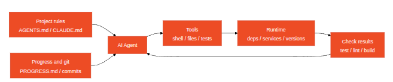

# notes on [hands on harness engineering course](https://hands-on-harness-engineering.com/)

## general principles

- A coding agent's reliability hinges on five things outside the model: 
    - a sane execution environment
    - clear instructions
    - durable state
    - the right tools
    - verification feedback
- AI coding agents are capable. The problem is making them _reliable_. 
- Anthropic found that agents confidently praise their own work, and the solution is to separate "the agent who does the work" from "the agent who checks the work."
- Common problems in harness engineering are:
    - Definition of Done: A set of machine-verifiable conditions — tests pass, lint is clean, type checks pass. Without an explicit definition of done, the agent will invent its own.
    - Verification Gap: The gap between the agent's confidence in its output and actual correctness. The agent says "I'm done" when it's not done — this is the most common failure mode.
- **Harness** definition: Everything outside the model — instructions, tools, environment, state management, verification feedback. If it's not model weights, it's harness.
- In harness engineering, a diagnostic loop consists of executing, observing, and attributing the failure to one of the 5 harness layers, to fix that layer, and to re-execute.
- In harness engineering, a system of record (SoR) is the central, authoritative data source that serves as the "single source of truth" for a project.
- one good methodology in testing harness quality is to stay "iso-model", meaning, don't swap models to get better results, improve each subsystem to the max before deciding to upgrade the model; also one good approach in improving a harness is to distinguish between:
    - "gulf of execution": agent does not know _how_ to do something
    - "gulf of verification": agent does not if what it built is _right_
- OpenAI distills the engineer's core job into three things: designing environments, expressing intent, and building feedback loops.
- The 5 defense layers in developing a good agentic application are: 
    - context provision
        - e.g. a `CLAUDE.md` at the repo root saying "use `pnpm`, not `npm`; tests live in `tests/`", so the agent doesn't have to guess
    - execution environment
        - e.g. the agent runs inside a Docker container with only the project folder mounted and no network access, so a bad `rm -rf` can't touch the host
    - state management
        - e.g. the agent keeps a `progress.md` checklist ("[x] add model, [ ] add API route") and commits after each step, so it can resume after a crash or context reset
    - task specification
        - e.g. instead of "fix the login", the task says "login with a wrong password must return HTTP 401 and show 'Invalid credentials'; don't touch the signup flow"
    - verification feedback
        - e.g. after each change the agent runs `pnpm test && pnpm lint` and reads the failures, looping until everything is green before saying it's done

## the five-subsystem harness model



In harnessing a coding agent, you'd have 5 subsystems:

- instruction
- tooling
- running environment
- state
- feedback

Usually, modifying a layer of the harness means adapting the other layers in some way.

### the instruction subsystem

It's the one that contains the project rules, materialized by the `AGENTS.md` file.

`AGENTS.md` (or `CLAUDE.md`) should contain:
    - a project overview and purpose (in one sentence)
    - first-run commands (e.g. `make setup`, `make test`, etc.)
    - non-negotiable hard constraints (for instance "All APIs must use OAuth 2.0")
    - tech stack and versions (e.g. Python 3.11, FastAPI 0.100+, PostgreSQL 1, etc.)
    - links to more detailed documentation for everything that does not fit the above

### the tooling subsystem

Ensure the agent has sufficient tool access. Don't disable shell for "security" — if the agent can't even run `pip install`, how is it supposed to work? But don't open everything either — follow least-privilege principles.

Usually, a tooling subsystem is expressed in terms of verbs for the coding agent.

### the running environement subsystem

Environment subsystem: Make the environment state self-describing and deterministic. 

This can span over things like using `pyproject.toml` or `package.json` to lock dependencies, `.nvmrc` or `.python-version` for runtime versions, Docker or dev containers for reproducibility, etc.

### the state subsystem

Long tasks need progress tracking. This mean each task needs to produce a durable artifact that the next session can read.

You can get by with a simple `PROGRESS.md` file recording: what's done, what's in progress, what's blocked. This is to be updated before each session ends and to be read when the next session starts.

### the feedback subsystem

This is the highest-ROI subsystem. It should consist of a list of verification commands referenced in `AGENTS.md`. 

The feedback subsystme checks for verification signals (exit codes, stdout,` node --test output`, etc.).
It is also constitued by plain automatic testing.


Example below

```txt
Verification commands:
- Tests: pytest tests/ -x
- Type check: mypy src/ --strict
- Lint: ruff check src/
- Full verification: make check (includes all above)
```

...
